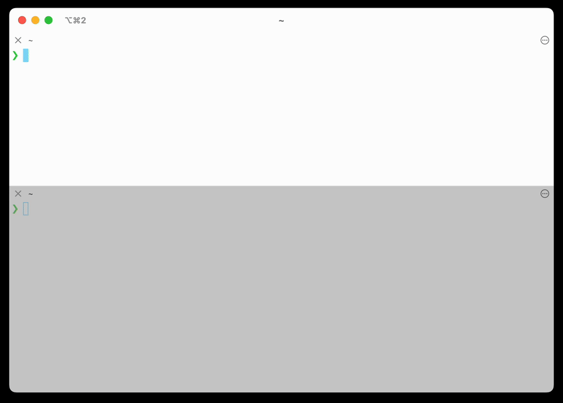

<div align="center">
  
  
  [](https://opensource.org/licenses/MIT)
  [](https://github.com/danielpgross/rmate-server/releases)
  [](https://ziglang.org/)
  [](https://github.com/danielpgross/rmate-server)
</div>

# RMate Launcher

Seamlessly edit files over SSH with a local editor of your choice, using the rmate protocol.

## Overview

- ✅ **Lightweight & Simple** - No external dependencies: runs in ~1MB RAM, installs with a single binary
- ✅ **Multiple concurrent files** with real-time OS-level file watching
- ✅ **Cross-platform** (Linux, macOS) with statically linked binaries
- ✅ **Editor agnostic** - VS Code, Sublime Text, Zed, etc.
- ✅ **Always available** - Runs as standalone service, independent of editor

### Demo



### How it works

1. RMate client on remote server connects via SSH tunnel to local RMate Launcher
2. Server saves file content to temp file and watches for changes with OS-level notifications
    - Temp files mirror the remote path under a per-host directory: `~/.rmate_launcher/<hostname>/<remote path>` (e.g., `hostname:/etc/foo/bar.txt` -> `~/.rmate_launcher/hostname/etc/foo/bar.txt`).
3. Server spawns local editor to edit temp file
4. Changes trigger `save` commands; editor close triggers `close` command

### Why the rmate protocol?

Originally developed for [TextMate](https://github.com/textmate/rmate), this is a proven protocol for editing remote files through SSH tunnels. It's widely supported with clients in [Ruby](https://github.com/textmate/rmate) (original), [Bash](https://github.com/aurora/rmate), [Python](https://github.com/sclukey/rmate-python), [Perl](https://github.com/davidolrik/rmate-perl), [Nim](https://github.com/aurora/rmate-nim), [C](https://github.com/hanklords/rmate.c), [Node.js](https://github.com/jrnewell/jmate), and [Go](https://github.com/mattn/gomate). Use any existing client with RMate Launcher - no changes required.

### Why not use existing editor extensions?

Editor-specific extensions ([RemoteSubl](https://github.com/randy3k/RemoteSubl), [Remote VSCode](https://github.com/rafaelmaiolla/remote-vscode)) require the editor to be running, have inconsistent behavior, and lock you into one editor. RMate Launcher provides consistent functionality across all editors and future-proof remote editing.

## Usage

```bash
# 1. Start server locally (skip this step if already running as a service)
RMATE_EDITOR="code --wait" rmate_launcher &

# 2. Start SSH session with tunnel
ssh -R 52698:~/.rmate_launcher/rmate.sock user@remote-server

# 3. Edit remote files (opens in your local editor!)
# In remote SSH session:
rmate /path/to/remote/file.txt
```

### Optional: Automatic SSH Config

Add to `~/.ssh/config` for automatic forwarding:
```ssh-config
Host myserver.example.com          # For specific hosts
    RemoteForward 52698 ~/.rmate_launcher/rmate.sock

Host *                            # For all hosts (optional)
    RemoteForward 52698 ~/.rmate_launcher/rmate.sock
```

### Optional: Set `rmate` as the default editor on the remote

On the remote host (after you have `rmate` installed and executable, and your SSH session is forwarding as shown above):

```bash
echo 'export VISUAL="rmate -w"' >> ~/.zshrc
echo 'export EDITOR="$VISUAL"' >> ~/.zshrc
. ~/.zshrc
```

#### Edit root-owned files safely (sudoedit)

Use `sudoedit` (aka `sudo -e`) so your editor runs unprivileged while sudo writes back with root permissions.

```bash
echo 'export SUDO_EDITOR="rmate -w"' >> ~/.zshrc
. ~/.zshrc

sudoedit /etc/ssh/sshd_config   # or: sudo -e /etc/hosts

sudo EDITOR="rmate -w" visudo
```

## Installation

### From GitHub Releases

Download binaries from the [releases page](../../releases):

| Platform | Architecture | Binary |
|----------|-------------|--------|
| Linux | Intel/AMD (x86_64) | `rmate_launcher-linux-x86_64.tar.gz` |
| Linux | ARM64 (aarch64) | `rmate_launcher-linux-aarch64.tar.gz` |
| macOS 10.15+ | Intel (x86_64) | `rmate_launcher-macos-x86_64.tar.gz` |
| macOS 10.15+ | Apple Silicon (aarch64) | `rmate_launcher-macos-aarch64.tar.gz` |

```bash
# Download and install (example for Linux x86_64)
curl -L -o rmate_launcher.tar.gz https://github.com/danielpgross/rmate_launcher/releases/latest/download/rmate_launcher-linux-x86_64.tar.gz
tar -xzf rmate_launcher.tar.gz && chmod +x rmate_launcher-linux-x86_64
mv rmate_launcher-linux-x86_64 /usr/local/bin/rmate_launcher
```

### From Source

Requires [Zig](https://ziglang.org/) 0.14.1+:
```bash
git clone https://github.com/danielpgross/rmate_launcher.git && cd rmate_launcher
zig build -Doptimize=ReleaseSmall  # or just 'zig build' for development
```

## Running as a service

For daily use, run it as a system service. Templates are provided to set up the service on macOS and Linux:

#### macOS (launchd)

```bash
mkdir -p ~/.rmate_launcher
cp macos-launchd.plist.example ~/Library/LaunchAgents/com.user.rmate_launcher.plist
# Edit plist: paths, RMATE_EDITOR, RMATE_SOCKET, sandbox settings
launchctl load ~/Library/LaunchAgents/com.user.rmate_launcher.plist
launchctl start com.user.rmate_launcher
```

#### Linux (systemd)

```bash
mkdir -p ~/.rmate_launcher ~/.config/systemd/user
cp linux-systemd.service.example ~/.config/systemd/user/rmate_launcher.service
# Edit service: paths, RMATE_EDITOR, RMATE_SOCKET
systemctl --user daemon-reload && systemctl --user enable --now rmate_launcher
sudo loginctl enable-linger $USER  # Start on boot (optional)
```

## Configuration

All configuration is defined in environment variables.

### Required

`RMATE_EDITOR` - Editor command to run
* Path to the temp file will be passed as the first argument.
* **Command must block until editing is done** (pass `--wait` flag or similar).
```bash
export RMATE_EDITOR="code --wait"    # VS Code
export RMATE_EDITOR="vim"            # Vim  
export RMATE_EDITOR="subl --wait"    # Sublime Text
```

### Optional Configuration

- `RMATE_SOCKET` - Unix socket path (default: `~/.rmate_launcher/rmate.sock`)
- `RMATE_PORT` / `RMATE_IP` - Legacy TCP options (default: `52698/127.0.0.1`, less secure)

### Advanced: Dynamic editor selection

Since `RMATE_EDITOR` can be any command, you can use a bash script to launch different editors based on file patterns. The script receives the mirrored temp path (e.g., `~/.rmate_launcher/<hostname>/...`), so you can route by hostname, remote path, or file extension:

```bash
#!/bin/bash
# ~/.rmate_launcher/editor-selector.sh
case "$(basename "$1")" in
    *.md|*.txt|README*) zed --wait "$1" ;;           # Docs in Zed
    *.js|*.ts|*.json|*.html) code --wait "$1" ;;     # Web dev in VS Code  
    *) subl --wait "$1" ;;                           # Everything else in Sublime
esac
```
```bash
chmod +x ~/.rmate_launcher/editor-selector.sh
export RMATE_EDITOR="$HOME/.rmate_launcher/editor-selector.sh"
```

## Development

**Prerequisites:** [Zig](https://ziglang.org/) 0.14.1+

```bash
zig build                                                    # Development build
zig build -Doptimize=ReleaseSmall                           # Optimized build  
zig build test                                               # Run tests
zig build -Dtarget=x86_64-linux-gnu -Doptimize=ReleaseSmall # Cross-compile

# Run locally
export RMATE_EDITOR="code --wait" && zig build run
```

## Technical Design

**File Watching**: Uses native OS APIs - `kqueue` on macOS/BSD and `inotify` on Linux - for efficient, real-time file change notifications without polling or external dependencies.

**Threading**: Multi-threaded architecture with dedicated threads for the main accept loop, individual client handlers, and per-file watchers.

**Static Compilation**: Direct use of native OS APIs enables static compilation to a single binary with zero runtime dependencies.

## License

MIT